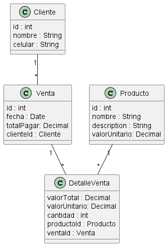

# Parcial Análsis de Sistemas - Corte 2. 

* Se requiere construir un sistema para controlar las ventas de una tienda de `frutas`. La idea es mantener los datos de los clinetes `nombre`, `celular`, también, conocer el historial de compras con `fecha`, `valor de la compra` y el `coste actual del producto`, asociar una `cantidad` y un `producto` . Se requiere que el sistema, pueda mantener los datos básicos de los productos de manera generica, esto para evitar cambios en los datos al momento de la venta, guardar `nombre del producto`, `valor unitario` y  `descripción`. 

#### Análisis: Definición de requerimientos. 

* Cliente{id, nombre, celular}
* Producto{id, nombre, descripcion, valorUnitario}
* Venta {id, fecha, valorCompra, ref:Producto consteActualProducto, ref:Producto nombreProducto, cantidad, ref:Cliente nombre}

1. RF1: 
    * Realizar la CRUD de cliente, dónde se requiere la siguiente estructura de la entidad: `Cliente{nombre, celular}`
    - No puede existir un clientee con el mismo número de celular.
    - Cuando se va a registrar el cliente y diligencia los datos, si el cliente ya existe, el sistema debe informar que este ya existe. 
2. RF2: 
    * Realizar la CRUD de Producto, dónde se requiere la siguiente estructura de la entidad: `Producto{nombre, descripcion, valorUnitario}`
    - No se permite registrar productos con el mismo nombre
    - El sistema debe permitir al usuario que tenga autorización, realizar la actualización sobre el coste del producto.
    - No de debe permitir eliminar un producto del sistema, cuando este ya tenga ventas.
3. RF3: 

> Ver
